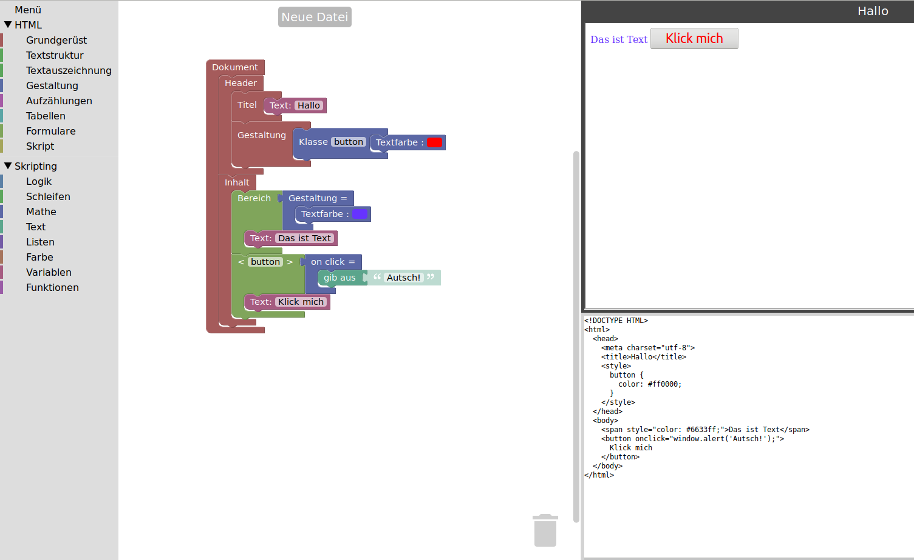

# Blockly-HTML - this is my fork of the original repository

Blockly blocks and generators for HTML generation and a demo with live preview.

There is demo of the original version that can be tested here: http://blocklyhtml.zgtm.de/

Respective german demo is available as well: http://htmlbausteine.zgtm.de/

## Try the demo

Or you can simply checkout the repository or unzip.

The demo saves the workspace via download in the preset download folder. 

Additionally, it supports importing and exporting blocks (Blockly XML) and exporting the HTML document.

A German localisation of the demo can be enabled by loading `html_de.js` instead of `html_en.js` in the header of the HTML file. (This also needs `de.js` from Blockly which is also supplied here.)
